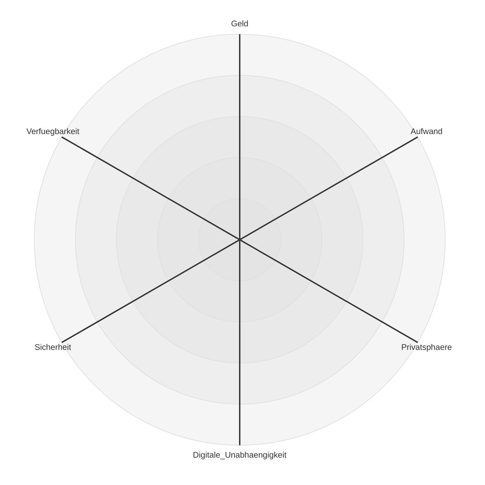

# Digitale Unabhängigkeit in der Familie

<!-- 
Bei den meisten Vorträgen standen die einzelne Person und die Daten des Einzelnen im Fokus.
Aber:
Daten gehören oft nicht nur uns allein.
Und die zugehörigen Dienste nutzen wir ebenfalls nicht allein.

Und eine Institution, in der besonders viele persönliche Daten ausgetauscht werden: die Familie.
-->
---

## Die Familie im Blick von Google, Microsoft und Co.
* Google Family Group
* Microsoft Family
* Apple Family Sharing
* Tutanota-Familienoption
* Proton Family

<!-- 
Interessante Profildaten für Werbekunden
Viele große und kleine Firmen sehen Familien als interessante Zielgruppe für zusätzliche Dienste.
Lock-in-Effekt: Kinder bleiben beim Anbieter, Eltern legen bei der Geburt eine E-Mail-Adresse an.
-->

---

## Die digitalen Daten einer Familie
* Bilder, Filme und Dokumente
* Accounts, Passwörter und Zugangsdaten
* Kalenderdaten
* Kontakte
* Chat-Nachrichten

## Dienste und IT-Infrastruktur
* Messenger
* Passwort-Manager
* Cloudspeicher
* E-Mail-Provider
* Sonstiges: DSL, Netflix

<!-- 
Wir nähern uns ausgehend von den Daten.
Wir konzentrieren uns auf die engere Familie, aber viele Probleme sind übertragbar
-->

---

# Welche Personen gehören zur Familien-IT?
* Familie: Ehepartner und Kinder
* Eigene Eltern und Verwandte: Großeltern, Onkel, Tanten usw.
* Freunde und Bekannte: enge Freunde, Nachbarn usw.

---
layout: section
---
## Gibt es die eine Lösung?

---

# Zielkonflikte in der Familien-IT

---
layout: two-cols-header
---

::left::
# Fragen
* Wie setze ich Prioritäten?
* Bin ich bereit, Geld zu bezahlen, und wenn ja, wie viel?
* Wie viel Aufwand betreibe ich für eigenes Hosting?
* Wie viel Aufwand und Energie bin ich bereit zu investieren?
* Alles in ein Ökosystem? Oder lieber aufteilen?

<!-- 
Digitale Unabhängigkeit nur eine von vielen Prioritäten
Manche Fragen ergeben sich automatisch
Man kann nicht alle Dimensionen zu 100% erfüllen.
Prioritäten setzen
eventuell werden Prioritäten durch äußere Zwänge gesetzt
-->

::right::

# Zusätzliche Hürden
* Ziele sind konträr
* Konsensfindung in der Familie
* Unterschiedliche Prioritäten in der Familie
* Unterschiedliches Wissen in der Familie

<!-- 
Ähnlich wie bei Einzelpersonen, aber es gibt zusätzliche Hürden 
-->

---
layout: section
---

# Empfehlungen und Ratschläge

<!-- 
Wenn es schon nicht die eine Lösung gibt, gibt es zumindest Empfehlungen 
-->

---

# Familienadministrator:in

* Single Point of Failure
* Auch eine Form der digitalen Abhängigkeit
* Selbstverwirklichung und Hobby

In Notfällen ist der Rest der Familie mit der Familien-IT überfordert.

<!-- 
Es muss nicht der männliche IT-Nerd sein, der sich selbst verwirklicht.
Verschiedene Formen und Ausprägungen
DSL, Owner des Familienkalenders
Notfälle: Tod, Scheidung, Krankheit und Urlaub
Es muss auch nicht eine Person sein
-->
---

# Dokumentation der Familien-IT
Die Dokumentation der Familien-IT ist wichtig.

* Notfalls-Accounts und Recovery
* Zuständigkeiten klären und dokumentieren
* Backup-Best-Practices bedenken
* Kenntnisstand der Familie berücksichtigen
* Recovery üben

---

# Wie dokumentiert man die Familien-IT?

* Papier
* Niedrigschwellig
* Backup-Best-Practices bedenken

---

# Backups und Recovery

---

# Notfälle: Was passiert bei Krankheit, Tod, Trennung

---

# Notfälle: Verlust von Accounts

<!-- 
Betrifft auch Einzelpersonen

-->

---

# Themen, die wir übersprungen haben

* Sicherheit
* Zugriffsberechtigungen
* Privatsphäre in der Familie
* Kinder und der Übergang in die Selbstständigkeit

---

# Fazit
* Erste Schritte:
  * Prioritäten setzen
  * Dokumentation und Inventar erstellen
  * Wichtige Passwörter und Accounts "sicher" dokumentieren?
  * Recovery-Optionen klären
  * Rollen und Zuständigkeiten klären.
  * Klären, was wichtig ist.
  * Backups einrichten

---

# Quellen und weiterführende Informationen
* https://www.my-it-brain.de/wordpress/dokumentation-fuer-den-notfall-bzw-das-digitale-erbe/
* https://www.my-it-brain.de/wordpress/nerds-gefaehrden-die-digitale-souveraenitaet-ihrer-familie/

