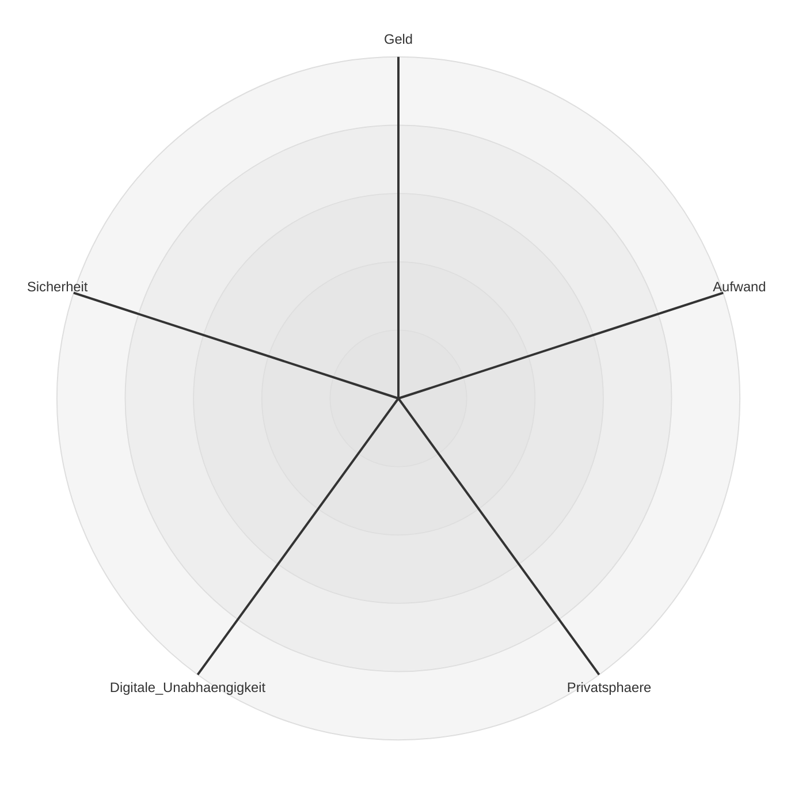

# Digitale Unabhängigkeit in der Familie 

<!-- 
Bei den meisten Vorträgen standen die einzelne Person und die Daten des Einzelnen im Fokus.
Aber:
Daten gehören oft nicht nur uns allein.
Und die zugehörigen Dienste nutzen wir ebenfalls nicht allein.

Und eine Institution, in der besonders viele persönliche Daten ausgetauscht werden: die Familie.
-->
---

## Die Familie im Blick von Google, Microsoft und Co.
* Google Family Group
* Microsoft Family
* Apple Family Sharing
* Tutanota-Familienoption
* Proton Family

<!-- 
Interessante Profildaten für Werbekunden
Viele große und kleine Firmen sehen Familien als interessante Zielgruppe für zusätzliche Dienste.
Lock-in-Effekt: Kinder bleiben beim Anbieter, Eltern legen bei der Geburt eine E-Mail-Adresse an.
-->

---

## Die digitalen Daten einer Familie
* Bilder, Filme und Dokumente
* Accounts, Passwörter und Zugangsdaten
* Kalenderdaten
* Kontakte
* Chat-Nachrichten

## Dienste und IT Infrastruktur
* Messenger
* Passwort-Manager
* Cloudspeicher
* E-Mail-Provider
* Sonstiges: DSL, Netflix

<!-- 
Wir nähern uns ausgehend von den Daten.
Wir konzentrieren uns auf die engere Familie, aber viele Probleme sind übertragbar
-->

---

# Welche Personen gehören zur Familien-IT?
* Familie: Ehepartner und Kinder
* Eigene Eltern und Verwandte: Großeltern, Onkel, Tanten usw.
* Freunde und Bekannte: enge Freunde, Nachbarn usw.

---
layout: section
---
## Gibt es die eine Lösung?

---

# Zielkonflikte in der Familien IT

---

# Das magische Vieleck der Familien-IT

* Geld
* Aufwand
* Privatsphäre
* Digitale Unabhängigkeit
* Sicherheit

---

# Fragen
* Wie setze ich Prioritäten?
* Bin ich bereit, Geld zu bezahlen, und wenn ja, wie viel?
* Wie viel Aufwand betreibe ich für eigenes Hosting?
* Wie viel Aufwand und Energie bin ich bereit zu investieren?
* Alles in ein Ökosystem? Oder lieber aufteilen?

<!-- 
Digitale Ünabhängigkeit nur eine von vielen Prioritäten
Manche Fragen ergeben sich automatisch
Man kann nicht alle Dimensionen zu 100% erfüllen.
Prioritäten setzen
eventuell werden Prioritäten durch äußere Zwänge gesetzt
-->

---
layout: section
---
## Empfehlungen und Ratschläge

<!-- Wenn es schon nicht die eine Lösung gibt, gibt es zumindest Empfehlungen -->

---

---

# Quellen und weiterführende Informationen
