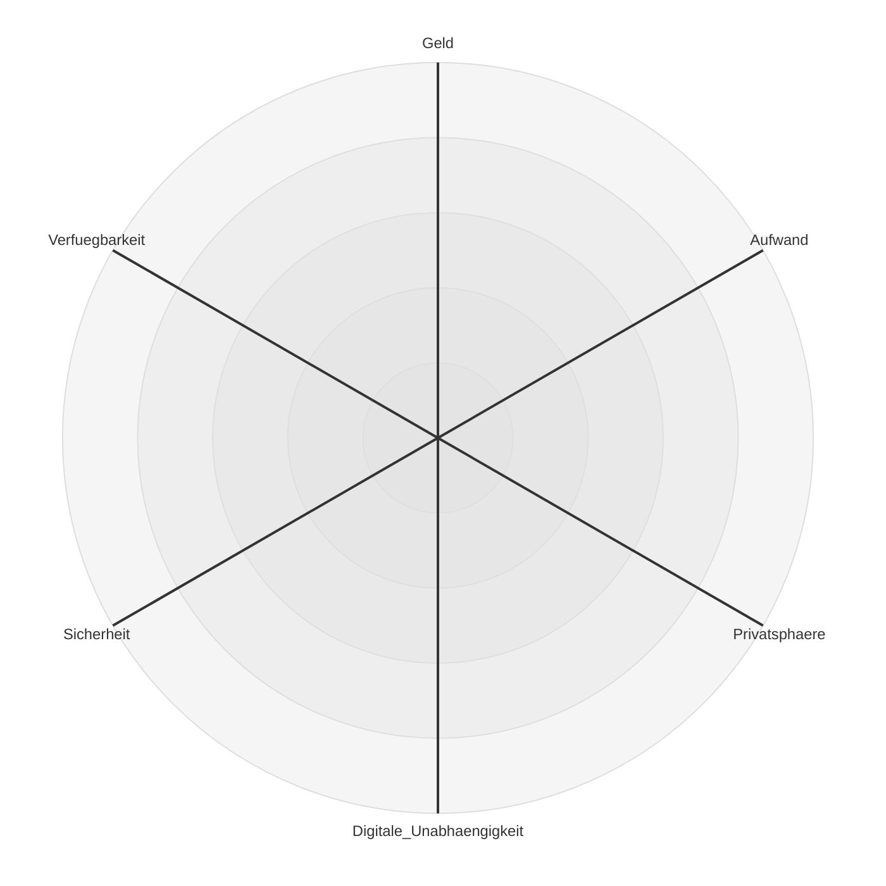

# Digitale Unabhängigkeit in der Familie

<!-- 
Bei den meisten Vorträgen standen die einzelne Person und die Daten des Einzelnen im Fokus.
Aber:
Daten gehören oft nicht nur uns allein.
Und die zugehörigen Dienste nutzen wir ebenfalls nicht allein.

Und eine Institution, in der besonders viele persönliche Daten ausgetauscht und geteilt werden ist die Familie.
-->
---

# Die Familie im Blick von Google, Microsoft und Co.
* Google Family Group
* Microsoft Family
* Apple Family Sharing
* Tutanota-Familienoption
* Proton Family

<!-- 
Interessante Profildaten für Werbekunden
Viele große und kleine Firmen sehen Familien als interessante Zielgruppe für zusätzliche Dienste.
Lock-in-Effekt: Kinder bleiben beim Anbieter, Eltern legen bei der Geburt eine E-Mail-Adresse an.
-->

---

# Die digitalen Daten einer Familie
* Bilder, Filme und Dokumente
* Accounts, Passwörter und Zugangsdaten
* Kalenderdaten
* Kontakte
* Chat-Nachrichten

# Dienste und IT-Infrastruktur
* Messenger
* Passwort-Manager
* Cloudspeicher
* E-Mail-Provider
* Streaming-Dienste
* Internet-Provicder

<!-- 
Wir nähern uns ausgehend von den Daten.
-->

---

# Welche Personen gehören zur Familien-IT?
* Familie: Ehepartner und Kinder
* Eigene Eltern und Verwandte: Großeltern, Onkel, Tanten usw.
* Freunde und Bekannte: enge Freunde, Nachbarn usw.

<!-- Wir konzentrieren uns auf die engere Familie, aber viele Probleme sind übertragbar -->

---

# Zielkonflikte in der Familien-IT

---
layout: two-cols-header
---

::left::
# Fragen
* Wie setze ich Prioritäten?
* Ziele sind konträr
* Bin ich bereit, Geld zu bezahlen, und wenn ja, wie viel?
* Wie viel Aufwand und Energie bin ich bereit zu investieren?
* Alles in ein Ökosystem? Oder lieber aufteilen?

<!-- 
Digitale Unabhängigkeit nur eine von vielen Prioritäten
Manche Fragen ergeben sich automatisch
Man kann nicht alle Dimensionen zu 100% erfüllen.
Prioritäten setzen
eventuell werden Prioritäten durch äußere Zwänge gesetzt
-->

::right::

# Zusätzliche Probleme
* Konsensfindung in der Familie
* Unterschiedliche Prioritäten in der Familie
* Unterschiedliches Wissen in der Familie
* Manche Ausnahmezustände und Probleme betreffen nur Familien

<!-- 
Ähnlich wie bei Einzelpersonen, aber es gibt zusätzliche Hürden  und Probleme
Scheidung und Verlassen der Familie
-->

---

# Erstes Fazit

Es macht Sinn Familien genauer zu betrachten

---
layout: section
---

# Von der Betrachtung zur Praxis

<!-- 
Wenn es schon nicht die eine Lösung gibt, gibt es zumindest Empfehlungen 
-->

---

# Das Familienadministrator:in Problem

* Single Point of Failure
* Auch eine Form der digitalen Abhängigkeit
* Selbstverwirklichung und Hobby

Bei Problemen sind wichtige Daten nicht verfügbar

<!-- 
Keine Digitale Unabhängigkeit
Es muss nicht der männliche IT-Nerd sein, der sich selbst verwirklicht.
Verschiedene Formen und Ausprägungen
DSL, Owner des Familienkalenders
Notfälle: Tod, Scheidung, Krankheit und Urlaub
Es muss auch nicht eine Person sein
-->
---

# Dokumentation der Familien-IT
Die Dokumentation der Familien-IT ist wichtig.

* Bestandteile der Familiien-IT:
*  Geräte
*  Wichtige Accounts und deren Recovery Option
* Backups dokumentieren
* Zuständigkeiten dokumentieren
* Kenntnisstand der Familie berücksichtigen
* Review durch Familienmitglieder
* Recovery üben

<!--

 Man kann direkt anfangen noch andere Sachen zu dokumentieren, 
Bankdaten, Versicherung usw
-->

---

# Wie dokumentiert man die Familien-IT?

* Niedrigschwellig: USB-Stick mit Text-Dokumenten, PDF, Papier
* Backup-Best-Practices beachten
* Sicherheit nicht vergeressen
* Aktualisierung und Testlauf sind wichtig

<!-- 

-->

---

# Notfälle: Was passiert bei Krankheit, Tod, Trennung und Urlaub

<!--
Der Tod und Krankheit wird oft ignoriert, aber es kann auch sein, daß ein Familienmitglied nicht greifbar ist.

Das Internet geht nicht, aber keiner weiß das Passwort der Fritzbox.
Oder man einen IT-Experten in der Familie, weiß die Familie vielleicht gar nicht, welche blinkende Kästchen im Keller dafür zustandig ist.

Kein Zugriff oder Verlust von Dokumenten und Photos weil man auf die Accounts nicht zugreifen kann.
Passwörter für verschlüsselte Dokumente fehlen.

Deswegen ist die Dokumentation so wichtig
Das macht dann auch die Qualität der Dokumentation aus

Gleichzeitig bieten manche Cloud-Dienst leister für Fälle Vertretungs und Recovery-Optionen an. Die sollte man in der Dokumenation erwäjmem

Bei Trennung kommen noch Problem der Sabotasche dazu
Accounts werden gesperrt, Dokumente gelöscht usw

-->

---

# Notfälle: Verlust von Accounts

<!-- 
Betrifft auch Einzelpersonen

-->

---

# Themen, die wir übersprungen haben

* Sicherheit
* Zugriffsberechtigungen
* Privatsphäre in der Familie
* Kinder und der Übergang in die Selbstständigkeit
* Backups und Recovery

---

# Fazit
* Erste Schritte:
  * Prioritäten setzen
  * Dokumentation und Inventar erstellen
  * Wichtige Passwörter und Accounts "sicher" dokumentieren
  * Recovery-Optionen klären
  * Rollen und Zuständigkeiten klären
  * Klären, was wichtig ist
  * Backups einrichten

<!-- Der heutige Vortrag hat eine leicht andere Wendung genommen -->

---

# Quellen und weiterführende Informationen
* https://www.my-it-brain.de/wordpress/dokumentation-fuer-den-notfall-bzw-das-digitale-erbe/
* https://www.my-it-brain.de/wordpress/nerds-gefaehrden-die-digitale-souveraenitaet-ihrer-familie/

