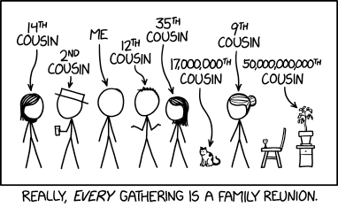
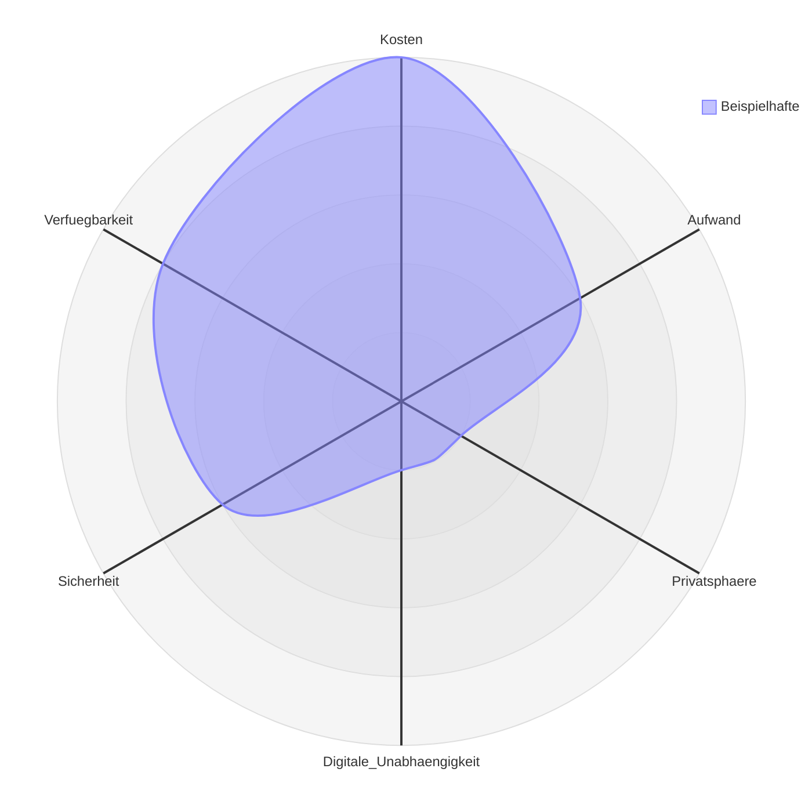

# Digitale Unabhängigkeit in der Familie

<!-- 
Bei den meisten Vorträgen standen die einzelne Person und die Daten des Einzelnen im Fokus.
Aber:
Daten gehören oft nicht nur uns allein.
Und die zugehörigen Dienste nutzen wir ebenfalls nicht allein.

Und eine Institution, in der besonders viele persönliche Daten ausgetauscht und geteilt werden ist die Familie.
-->
---
layout: section
---

# Motivation
---

# Familien als Zielgruppe

* Familien verbinden mehrere Nutzer und Geräte
* Gemeinsame Daten und Dienste fördern langfristige Bindung
* Anbieter verkaufen Familiengruppen, Abos und Verwaltung
* Kinder wachsen oft in ein Ökosystem hinein
* Ein Wechsel wird schwieriger, wenn vieles davon abhängt
* Verknüpfte Familiendaten sind für Werbezwecke interessant

Beispiele: Google Family, Microsoft Family, Apple Family Sharing, Proton Family

<!-- 
Viele Produkte, die auf Familien zugeschnitten sind: Das neuste Google CC
Unterschiedliche Schwerpunkte und Fokus
Interessante Profildaten für Werbekunden
Viele große und kleine Firmen sehen Familien als interessante Zielgruppe für zusätzliche Dienste.
Lock-in-Effekt: Kinder bleiben beim Anbieter, Eltern legen bei der Geburt eine E-Mail-Adresse an.
Auch das BSI und Verbraucherzentralen habeb Informationen zur Familien IT
-->

---

# Die digitalen Daten einer Familie

* Bilder, Filme und Dokumente
* Accounts, Passwörter und Zugangsdaten
* Kalenderdaten
* Kontakte
* Chat-Nachrichten

<!-- Familien können sich eventuell auch Accounts und Passwörter teilen -->

---

# Dienste und IT-Infrastruktur
* Cloudspeicher ( z.B. für Fotos, Dokumente )
* E-Mail-Provider
* Messenger
* Streaming-Dienste
* Internet-Provider
* Passwort-Manager

<!-- 
Vieles kommt uns bekannt vor
-->

---

# Wer ist Teil der Familien-IT?

Familien-IT betrifft mehr als Eltern und Kinder

* Familie: Ehepartner und Kinder
* Eigene Eltern und Verwandte: Großeltern, Onkel, Tanten usw.
* Freunde und Bekannte: enge Freunde, Nachbarn usw.

<!-- Wir konzentrieren uns auf die engere Familie, aber viele Probleme sind übertragbar -->

---

# Zielkonflikte in der Familien-IT

```mermaid {theme: 'neutral', scale: 0.6}
radar-beta
	axis Kosten, Aufwand, Privatsphaere, Digitale_Unabhaengigkeit, Sicherheit, Verfuegbarkeit
	curve Prioritaeten["Beispielhafte Prioritaeten"]{ 5, 3, 1, 1, 3, 4 }
	max 5
```
<!-- Digitale Unabhängigkeit ist nur eins von vielen Zielen-->
---
layout: two-cols-header
---
::left::
# Allgemeine Zielkonflikte
* Wie setzt man als Familie Prioritäten?
* Ziele stehen im Konflikt
* Bin ich bereit, für digitale Unabhängigkeit Geld auszugeben, und wenn ja, wie viel?
* Wie viel Aufwand und Energie bin ich bereit zu investieren?
* Alles in ein Ökosystem? Oder lieber aufteilen?

<!-- 
Digitale Unabhängigkeit nur eine von vielen Prioritäten
Manche Fragen ergeben sich automatisch
Man kann nicht alle Dimensionen zu 100% erfüllen.
Prioritäten setzen
Prioritäten durch äußere Zwänge gesetzt
-->

::right::

# Zusätzliche Hürden in Familien
* Konsensfindung in der Familie
* Unterschiedliche Prioritäten in der Familie
* Unterschiedliches Wissen in der Familie
* Manche Ausnahmezustände und Probleme betreffen nur Familien

<!-- 
Ähnlich wie bei Einzelpersonen, aber es gibt zusätzliche Hürden  und Probleme
Scheidung und Verlassen der Familie
-->

---
layout: section
---

# Konkrete Probleme

<!-- 

-->

---

# Das Problem mit der Familienadministration
Wenn eine Person ausfällt …

* Nur eine Person kennt die Familien-IT
* Zugänge und Zuständigkeiten sind unklar
* Wichtige Daten und Dienste werden unerreichbar
* Krankheit, Tod, Trennung oder Urlaub können reichen

Eine Person darf kein Single Point of Failure sein.

<!-- 
Bisher haben wir immer von Tech Riesen geredet und wie sie untere Digitale Souveränität untergraben.

Aber egal wie die konkrete Familien IT aussieht ( US Cloud Dienste und der FamilienServer im Keller), es bleibt das Problem des Familien Adminstrators

Zur Veranschaulichung folgendes Szenario: Ein Nerd managed die IT der Familie: eigener DNS Server, Firewall, Familien Domäne die beim Mail-Provider liegt, FileServer usw
Und dann passiert irgendwas: Krankheit oder Safari in Afrika 
Und gleichzeitig:  Zertifikat laeuft ab, der Passwortsafe liegen auf eine quantensicher verschlüsselten USB Stick und plötzlich geht das Internet nicht mehr

Oder

Alle wichtige FamilienDokumente liegen gesichert auf Dropbox, eine SSD faellt aus und ...

Digitale Abhängigkeit von einer Person

Der Tod und Krankheiten aber auch Hardware defekte werden oft verdrängt 

Es muss nicht der männliche IT-Nerd sein, der sich selbst verwirklicht: Auch Kinder die die IT der Eltern managen: Jung meine Fritz.box blinkt und das Wlan geht nicht mehr
Es muss auch nicht eine Person sein
Verschiedene Formen und Ausprägungen
Notfälle und ungünstige Verkettungen sind Vielfälltig: Tod, Scheidung, Krankheit und Urlaub

Das Problem tritt nicht nur in Familien auf.

-->
---

# Dokumentation der Familien-IT

Wir sollten uns über Dokumentation unterhalten!

* Geräte, Dienste und Daten erfassen
* Accounts und Wiederherstellungsoptionen dokumentieren
* Backups und Speicherorte dokumentieren
* Zuständigkeiten dokumentieren
* Kenntnisstand der Familie berücksichtigen
* Dokumentation gemeinsam überprüfen
* Wiederherstellung üben

 Die IT-Dokumentation gehört in den Notfallordner.

<!--
 Eine Lösung: Dokumentation 
 Inhalt kann varieren
 Notfalls kann man die DOkumentation einem Experten geben
 Man kann direkt anfangen noch andere Sachen zu dokumentieren: Bankdaten, Versicherung usw

-->

---

# Wie dokumentiert man die Familien-IT?

* Niedrigschwellig beginnen: Papier, PDF und USB-Stick
* Backup-Best-Practices beachten: Mehrere Kopien an verschiedenen Ort aufbewahren
* Sicherheit und Zugriffsschutz beachten
* Dokumentation regelmäßig aktualisieren
* Zuständigkeiten und Änderungen festhalten

 Die beste Dokumentation ist eine, die im Notfall gefunden und verstanden werden kann.

<!-- 
Ok, die Doku sollte gefunden und verstanden werden und bei Notfällen helfen
Es gibt Backup-Best Practices, die sollte man beachten: Verteile Kopiene
Teilweise muss Passwörter dokumentieren, die dürfen auf keinen Fall in fremde hände gegraten:
Verschlüsselung, Passwortsafe
-->

---

# Notfälle in der Familien-IT

## Auslöser:
* Krankheit und Tod
* Urlaub oder längere Abwesenheit
* Account- oder Geräteausfall

## Folgen
* Zugänge und Daten sind nicht erreichbar
* Niemand kennt Passwörter und Zuständigkeiten
* Dokumentation oder Backups fehlen

## Was hilft?
* Dokumentation für mehrere Personen
* Unabhängige, geschützte Backups
* Wiederherstellung regelmäßig testen

<!--

Wir haben jetzt dokumentiert: Ist denn damit die Digitale Unabhängigkeit gerettet?

Wir schauen uns mal ein paar Beispiele an

Die Auflistung ist nicht vollständig
Und manchmal kommt ein Problem nicht allein

Beispiele  haben wir eben schon aufgezählt:
Das Internet geht nicht, aber keiner weiß das Passwort der Fritzbox, weil der Familien Administrator in Urlaub ist.
Es ist unklar, welche blinkende Kästchen im Keller dafür zustandig ist.
Kein Zugriff oder Verlust von Dokumenten und Photos weil man auf die Accounts nicht mehr zugreifen kann.
Passwörter für verschlüsselte Dokumente fehlen.

Dokumentation würde hier helfen, aber die Qualität der Dokumentation ist wichtig
Gleichzeitig bieten manche Cloud-Dienstleister für solche Fälle Vertretungs und Recovery-Optionen an. Die sollte man in der Dokumenation erwähnen und nutzen

Aber: Dokumentation hilft nicht bei allen Notfällen und reicht alleine nicht, das sehen wir an den nächsten Beispielen
-->

---

# Verlust von Accounts
* Vergessene Zugangsdaten
* Account gesperrt oder übernommen

## Folgen
* Kein Zugriff auf Fotos, Dokumente und Nachrichten

## Vorbeugen
* Wichtige Daten unabhängig sichern
* Recovery-Optionen überprüfen

<!--

Account-Verlust kann jeden treffen, man muss nicht beim internationalen Strafgerichtshof arbeiten
Und man sollte vorsorgen und vorbeugen, damit nicht das ganze digitale Leben der Familie weg ist.

Betrifft eventuell die ganze Familie

Hier hilft Dokumentation nicht mehr

-->

---

# Trennung und Ausscheiden aus der Familien-IT

Eine Person muss die Familien-IT verlassen können, ohne sie lahmzulegen oder Daten anderer mitzunehmen.

## Besondere Vorkehrungen
* Zugriffsrechte
* Getrennte Konten
* Datenzuordnung
* Schutz vor Sabotage

<!-- 
Verlassen der Familien-IT: Es muss nicht die Scheidung, manchmal verlassen die Kinder den Haushalt

Bei Trennung kommen noch Problem der Sabotage dazu
Passwörter werden geändert, Dokumente gelöscht usw

-->

---

# Weitere wichtige Fragen 

* Sicherheit und Zugriffsberechtigungen
* Privatsphäre in der Familie
* Kinder auf dem Weg in die Selbstständigkeit
* Backups und Recovery
* Alternativen zu Google & Co
* Praktische Umsetzung
* Digitaler Nachlass

<!-- 
30 Minuten sind nicht viel für so ein umfangreiches Thema
Wit treffen uns seit fast einem Jahr und uns gehen die Themen nichts aus
Ich habe das Thema: Familienadministrator und dokumentation fand ich am wichtigsten
-->
---

# Fazit

## Erste Schritte

* Prioritäten sowie wichtige Dienste und Daten klären
* Familien-IT dokumentieren und Inventar erstellen
* Wichtige Zugänge sicher dokumentieren
* Recovery- und Vertretungsoptionen einrichten
* Zuständigkeiten klären sowie Backups einrichten und Wiederherstellung testen

<!-- 
Unabhängig wie die Famlien IT aussieht, die kann man immer noch umbauen, erstmal geht es um den Ist-Zustand
Fortsetzung folgt

-->

---

# Quellen und weiterführende Informationen
* https://www.my-it-brain.de/wordpress/dokumentation-fuer-den-notfall-bzw-das-digitale-erbe/
* https://www.my-it-brain.de/wordpress/nerds-gefaehrden-die-digitale-souveraenitaet-ihrer-familie/
* https://www.heise.de/news/Googles-KI-Agent-CC-soll-das-Familienleben-verwalten-11457659.html

# Bilder
* XKCD: https://xkcd.com/2608/

