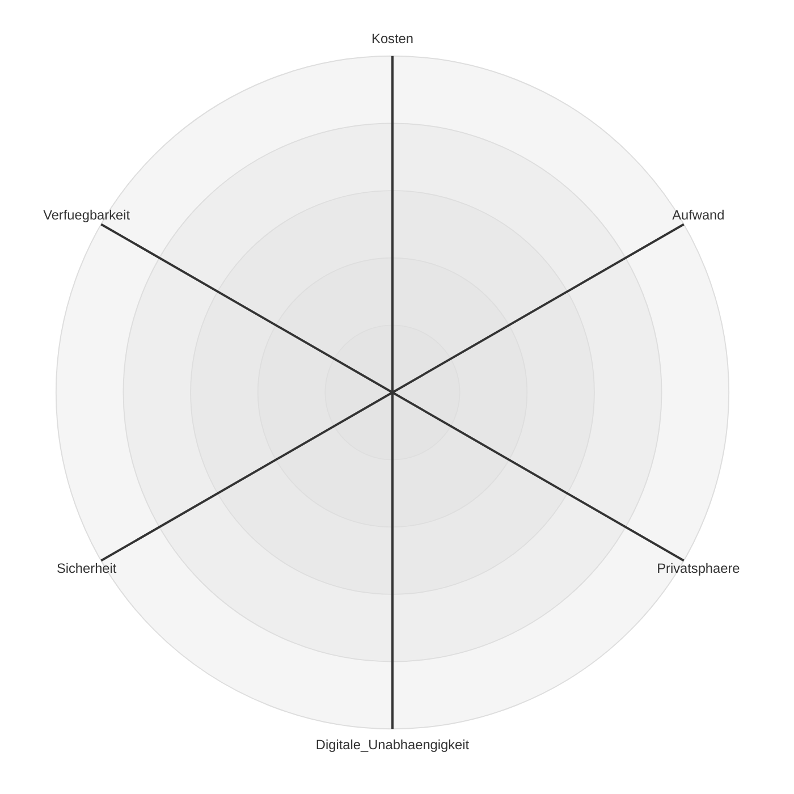

# Digitale Unabhängigkeit in der Familie

<!-- 
Bei den meisten Vorträgen standen die einzelne Person und die Daten des Einzelnen im Fokus.
Aber:
Daten gehören oft nicht nur uns allein.
Und die zugehörigen Dienste nutzen wir ebenfalls nicht allein.

Und eine Institution, in der besonders viele persönliche Daten ausgetauscht und geteilt werden ist die Familie.
-->
---
layout: section
---

# Motivation
---

# Die Familie im Blick von Google, Microsoft und Co.
* Google Family Group und Google CC
* Microsoft Family
* Apple Family Sharing
* Proton Family

<!-- 
Unterschiedliche Schwerpunkte und Fokus
Interessante Profildaten für Werbekunden
Viele große und kleine Firmen sehen Familien als interessante Zielgruppe für zusätzliche Dienste.
Lock-in-Effekt: Kinder bleiben beim Anbieter, Eltern legen bei der Geburt eine E-Mail-Adresse an.
Auch das BSI und Verbraucherzentralen habeb Informationen zur Familien IT
-->

---

# Die digitalen Daten einer Familie

* Bilder, Filme und Dokumente
* Accounts, Passwörter und Zugangsdaten
* Kalenderdaten
* Kontakte
* Chat-Nachrichten

---

# Dienste und IT-Infrastruktur
* Cloudspeicher ( z.B. für Fotos, Dokumente )
* E-Mail-Provider
* Messenger
* Streaming-Dienste
* Internet-Provider
* Passwort-Manager

<!-- 
Vieles kommt uns bekannt vor
-->

---

# Welche Personen gehören zur Familien-IT?

Familie ist vielfältig!

* Familie: Ehepartner und Kinder
* Eigene Eltern und Verwandte: Großeltern, Onkel, Tanten usw.
* Freunde und Bekannte: enge Freunde, Nachbarn usw.

<!-- Wir konzentrieren uns auf die engere Familie, aber viele Probleme sind übertragbar -->

---

# Zielkonflikte in der Familien-IT

```mermaid {theme: 'neutral', scale: 0.6}
radar-beta
	axis Kosten, Aufwand, Privatsphaere, Digitale_Unabhaengigkeit, Sicherheit, Verfuegbarkeit
	max 5
```
<!-- Digitale Unabhängigkeit ist nur eins von vielen Zielen-->
---
layout: two-cols-header
---
::left::
# Zielkonflikte
* Wie setze man als Familie Prioritäten?
* Ziele sind konträr
* Bin ich bereit, für Digitale Unabhängigkeit Geld auszugeben, und wenn ja, wie viel?
* Wie viel Aufwand und Energie bin ich bereit zu investieren?
* Alles in ein Ökosystem? Oder lieber aufteilen?

<!-- 
Digitale Unabhängigkeit nur eine von vielen Prioritäten
Manche Fragen ergeben sich automatisch
Man kann nicht alle Dimensionen zu 100% erfüllen.
Prioritäten setzen
Prioritäten durch äußere Zwänge gesetzt
-->

::right::

# Zielkonflikte in Familien
* Konsensfindung in der Familie
* Unterschiedliche Prioritäten in der Familie
* Unterschiedliches Wissen in der Familie
* Manche Ausnahmezustände und Probleme betreffen nur Familien

<!-- 
Ähnlich wie bei Einzelpersonen, aber es gibt zusätzliche Hürden  und Probleme
Scheidung und Verlassen der Familie
-->

---
layout: section
---

# Konkrete Probleme

<!-- 

-->

---

# Das Problem mit der Familienadministration
Wenn eine Person ausfällt …

* Nur eine Person kennt die Familien-IT
* Zugänge und Zuständigkeiten sind unklar
* Wichtige Daten und Dienste werden unerreichbar
* Krankheit, Tod, Trennung oder Urlaub können reichen

Eine Person darf kein Single Point of Failure sein.

<!-- 
Bisher haben wir immer von Tech Riesen geredet und wie sie untere Digitale Souveränität untergraben.

Folgendes Szenario: Ein Nerd managed die IT der Familie: eigener DNS Server, Firewall, Familien Domäne die beim Mail-Provider liegt, FileServer usw
Und das passiert irgendwas: Krankheit, Tod, Safari in Afrika 
Und gleichzeitig:  Zertifikat laeuft ab, die Doku liegen auf eine quantensicher verschlüsselten USB Stick und plötzlich geht das Internet nicht mehr

Digitale Abhängigkeit von einer Person
Es muss nicht der männliche IT-Nerd sein, der sich selbst verwirklicht: Auch Kinder die die IT der Eltern managen
Es muss auch nicht eine Person sein
Verschiedene Formen und Ausprägungen
Notfälle sind Vielfälltig: Tod, Scheidung, Krankheit und Urlaub

-->
---

# Dokumentation der Familien-IT

* Geräte, Dienste und Daten erfassen
* Accounts und Wiederherstellungsoptionen dokumentieren
* Backups und Speicherorte dokumentieren
* Zuständigkeiten dokumentieren
* Kenntnisstand der Familie berücksichtigen
* Dokumentation gemeinsam überprüfen
* Wiederherstellung üben

 Die IT-Dokumentation gehört in den Notfallordner.

<!--
 Eine Lösung: Dokumentation 
 Man kann direkt anfangen noch andere Sachen zu dokumentieren, 
 Bankdaten, Versicherung usw
-->

---

# Wie dokumentiert man die Familien-IT?

* Niedrigschwellig beginnen: Papier, PDF und USB-Stick
* Backup-Best-Practices beachten: Mehrere Kopien aufbewahren
* Sicherheit und Zugriffsschutz beachten
* Dokumentation regelmäßig aktualisieren
* Zuständigkeiten und Änderungen festhalten

 Die beste Dokumentation ist eine, die im Notfall gefunden und verstanden werden kann.

<!-- 
Ok, die Doku sollte gefunden und verstanden werden und bei Notfällen helfen
Es gibt Backup-Best Practices, die sollte man beachten: Verteile Kopiene
Teilweise muss Passwörter dokumentieren, die dürfen auf keinen Fall in fremde hände gegraten:
Verschlüsselung, Passwortsafe
-->

---

# Notfälle in der Familien-IT

## Auslöser:
* Krankheit und Tod
* Urlaub oder längere Abwesenheit
* Account- oder Geräteausfall

## Folgen
* Zugänge und Daten sind nicht erreichbar
* Niemand kennt Passwörter und Zuständigkeiten
* Dokumentation oder Backups fehlen

## Was hilft?
* Dokumentation für mehrere Personen
* Unabhängige, geschützte Backups
* Wiederherstellung regelmäßig testen

<!--
Die Auflistung ist nicht vollständig
Der Tod und Krankheitn aber auch Hardware defekte werden oft verdrängt, 
Und manchmal kommt ein Problem nicht allein: 

Das Internet geht nicht, aber keiner weiß das Passwort der Fritzbox, weil der Familien administrator in Urlaub ist.
Es ist unklar, welche blinkende Kästchen im Keller dafür zustandig ist.
Kein Zugriff oder Verlust von Dokumenten und Photos weil man auf die Accounts nicht mehr zugreifen kann.
Passwörter für verschlüsselte Dokumente fehlen.

Dokumentation würde hier helfen, aber die Qualität der Dokumentation ist wichtig

Gleichzeitig bieten manche Cloud-Dienstleister für solche Fälle Vertretungs und Recovery-Optionen an. Die sollte man in der Dokumenation erwähnen

Dokumentation reicht nicht immer: Backup und Zugriffsberechtigungen

-->

---

# Verlust von Accounts
* Vergessene Zugangsdaten
* Account gesperrt oder übernommen

## Folgen
* Kein Zugriff auf Fotos, Dokumente und Nachrichten

## Vorbeugen
* Wichtige Daten unabhängig sichern
* Recovery-Optionen überprüfen

---

# Trennung und Ausscheiden aus der Familien-IT

Eine Person muss die Familien-IT verlassen können, ohne sie lahmzulegen oder Daten anderer mitzunehmen.

## Besondere Vorkehrungen
* Zugriffsrechte
* Getrennte Konten
* Datenzuordnung
* Schutz vor Sabotage

<!-- 
Account-Verlust kann jeden treffen, man muss nicht beim internationalen Gerichtshof arbeiten
Und da sollte man vorsorgen, damit nicht das ganze digitale Leben der Familie weg ist.
Backups helfen?
Eventuell selber hosten 
Reserve Email-Accounts als Recovery Option

Verlassen der Familien-IT: Es können auch Kinder sein

Bei Trennung kommen noch Problem der Sabotage dazu
Passwörter werden geändert, Dokumente gelöscht usw

-->

---

# Weitere wichtige Fragen

* Sicherheit und Zugriffsberechtigungen
* Privatsphäre in der Familie
* Kinder auf dem Weg in die Selbstständigkeit
* Backups und Recovery
* Alternativen zu Google & Co
* Praktische Umsetzung
* Digitaler Nachlass

<!-- 
30 Minuten sind nicht viel für so ein Umfangreiches Thema
-->
---

# Fazit

## Erste Schritte

* Prioritäten sowie wichtige Dienste und Daten klären
* Familien-IT dokumentieren und Inventar erstellen
* Wichtige Zugänge sicher dokumentieren
* Recovery- und Vertretungsoptionen einrichten
* Zuständigkeiten klären sowie Backups einrichten und Wiederherstellung testen

<!-- Wir haben Microsoft und Google nur einmal erwähnt -->

---

# Quellen und weiterführende Informationen
* https://www.my-it-brain.de/wordpress/dokumentation-fuer-den-notfall-bzw-das-digitale-erbe/
* https://www.my-it-brain.de/wordpress/nerds-gefaehrden-die-digitale-souveraenitaet-ihrer-familie/
* https://www.heise.de/news/Googles-KI-Agent-CC-soll-das-Familienleben-verwalten-11457659.html

# Bilder
* XKCD: https://xkcd.com/2608/

